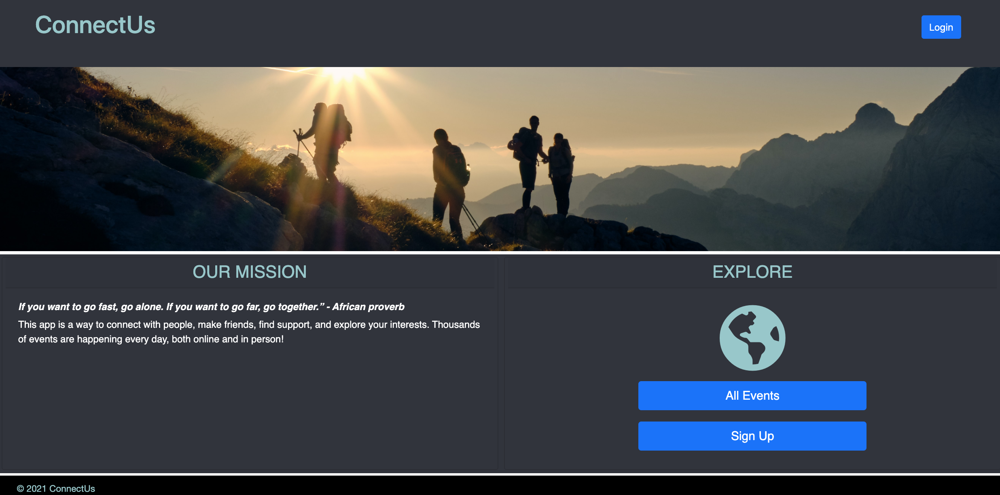

# Convectus

### This app is a group to meet people, make friends, find support, and explore your interests. Thousands of events are happening every day, both online and in person!

## Deployed application:

## Table of Contents
* [Technologies used](#technologies-used)
* [Features](#features)
* [Known bugs](#known-bugs)
* [Images](#stock-images-provided-by)
* [License](#license)
* [Contributors](#contributors)
* [Questions](#questions)

## Technologies Used
* HTML
* CSS
* JavaScript
* Bootstrap
* Handlebars
* Node packages used: sequelize, express, dotenv, path

## Features
Go to 

## Known Bugs

## Stock images provided by:
* [Kristjan Kotar](https://unsplash.com/photos/-h15p84GY5k)

## License
This project is licensed under the MIT license.

## Contributors
* Wendy Nguyen [@wendyqnguyen](https://github.com/wendyqnguyen) 
* Ellyse Carter [@ellysecarter](https://github.com/ellysecarter)
* Sean Hool [@HoolSeanalan](https://github.com/HoolSeanalan) 
* Adam Secord [@asecord92](https://github.com/asecord92)

## Questions?
If you have any questions about the project, contact any of the contributors above. 